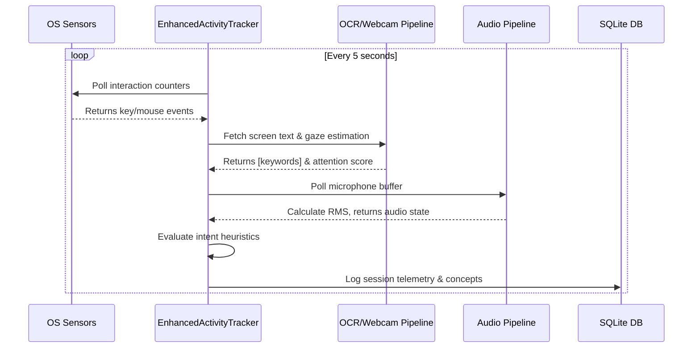
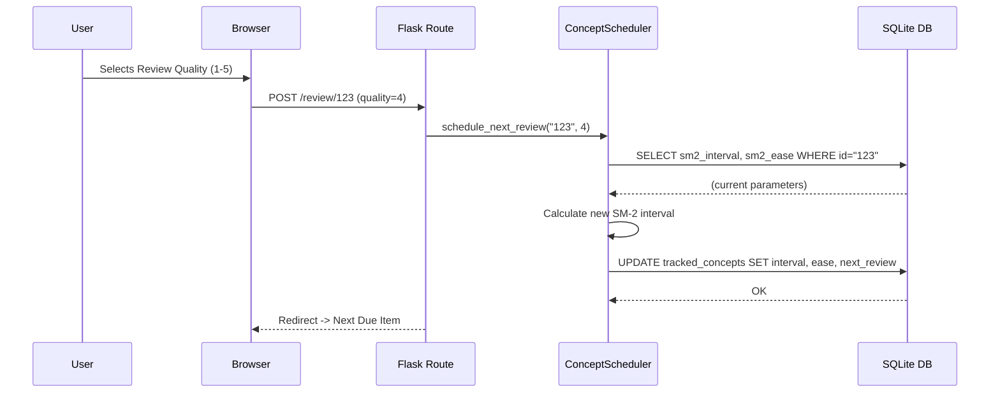

# Sequence Diagrams

## 1. Tracking Loop Data Ingestion Sequence

```mermaid
sequenceDiagram
    participant OS as OS Sensors
    participant Tracker as EnhancedActivityTracker
    participant CV as OCR/Webcam Pipeline
    participant Audio as Audio Pipeline
    participant DB as SQLite DB

    loop Every 5 seconds
        Tracker->>OS: Poll interaction counters
        OS-->>Tracker: Returns key/mouse events
        
        Tracker->>CV: Fetch screen text & gaze estimation
        CV-->>Tracker: Returns [keywords] & attention score
        
        Tracker->>Audio: Poll microphone buffer
        Audio-->>Tracker: Calculate RMS, returns audio state
        
        Tracker->>Tracker: Evaluate intent heuristics 
        
        Tracker->>DB: Log session telemetry & concepts
    end
```

## 2. Review Session (SM-2 Update)

```mermaid
sequenceDiagram
    participant User
    participant Browser
    participant Flask Route
    participant ConceptScheduler
    participant DB as SQLite DB

    User->>Browser: Selects Review Quality (1-5)
    Browser->>Flask Route: POST /review/123 (quality=4)
    Flask Route->>ConceptScheduler: schedule_next_review("123", 4)
    
    ConceptScheduler->>DB: SELECT sm2_interval, sm2_ease WHERE id="123"
    DB-->>ConceptScheduler: (current parameters)
    
    ConceptScheduler->>ConceptScheduler: Calculate new SM-2 interval
    
    ConceptScheduler->>DB: UPDATE tracked_concepts SET interval, ease, next_review
    DB-->>ConceptScheduler: OK
    
    Flask Route-->>Browser: Redirect -> Next Due Item
```
