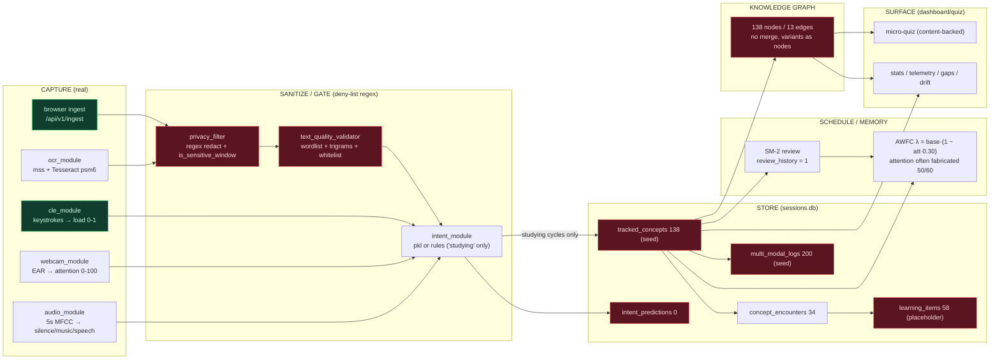

# FKT Pipeline Diagnosis — Garbage-In / Garbage-Out

Date: 2026-09-05
Scope: `tracker_app/` core (tracking, learning, db, web, scripts) + `data/` artifacts.
Method: read-only trace of every core component, verified against the live SQLite DB, the persisted knowledge-graph JSON, the tracking export, and computed cosine-similarity analysis of the stored node embeddings. No code was changed. Agentic config folders (`.agent`, `.opencode/node_modules`, `.hermes`, `.superpowers`, `.github/agents|prompts|skills`) were ignored.

Companion artifact: interactive call-DAG regenerated at `docs/dependency-map/index.html` (887 nodes / 663 edges).

---

## 1. Executive summary

FKT's pipeline is structurally sound on paper (capture → sanitize → extract → schedule → graph → quiz) but empirically **nothing real has ever flowed through it**. The database is populated with *synthetic, future-dated demo rows*; the few real capture rows are trivial; and every number the UI, scheduler, memory model and graph display is a pure function of that fabricated data. On top of that, the *text understanding* layer is a regex + deny-list + spelling-check heuristic, not NLP — so even real input leaks junk tokens and sensitive/chrome words while near-duplicate concepts are never merged. The result is exactly what the user reported: **garbage in, garbage out**.

The fix is not another feature — it is a **deliberate reset, a captured-data-first intake channel, and a gated re-enablement** (Section 8).

---

## 2. Evidence ledger (measured, not inferred)

All numbers were read directly from `tracker_app/data/sessions.db`, `knowledge_graph.json`, and `tracking_export.json` on this date.

### Storage (`sessions.db`)

| Table | Rows | Interpretation |
|---|---|---|
| `tracked_concepts` | 138 | All synthetic academic terms (see below) |
| `concept_encounters` | 34 | 29 `browser_extension` + 5 `ocr` — near-zero real capture |
| `learning_items` | 58 | Auto-promoted deck; answers are boilerplate placeholders |
| `sessions` | 100 | Seed rows: `start_ts/end_ts/app_name/window_title/interaction_rate…` with **concept names as window titles** |
| `multi_modal_logs` | 200 | Future-dated (2026-07-10 → 08-10), ~2–11/day, suspiciously uniform class balance |
| `tracking_sessions` | 2 | Only real runtime session rows found (one with 156 "concepts") |
| `memory_decay` | 54 | Seed rows; fabricated `attention_at_encoding` |
| `review_history` | 1 | One single review in the history of the product |
| `intent_predictions` | 0 | Intent feedback loop never had real input |
| `feedback_training_samples` | 0 | **No real retraining samples ever captured** |
| `intent_accuracy` | 0 | — |
| `metrics` | 0 | Seeded `__seed__` marker is gone; runtime metrics never wrote |
| `daily_summary`, `triage_queue` | 0 | "Dashboard" features exist, have never produced data |

### Corruption specifics

- `tools/populate.py` DELETEs six tables then INSERTs fabricated academic concepts (gated only by env `FKT_SEED=1`). See `populate.py:33-37`.
- `tracked_concepts.attention_at_encoding`: min 0.0, max 88.0, mean 39.2 — randomized, not measured.
- Timestamps are future-dated (e.g. `multi_modal_logs` scattered Jul–Aug 2026, `review_history` at 2026-08-17). Seed generator anchored rows to `utcnow()` offsets.
- `audio_label` balance across 200 rows: silence 53 / music 52 / speech 55 / unknown 40 — uniform distribution typical of a random generator, impossible for real ambient audio.
- `sessions.window_title` contains concept strings ("quicksort", "cognitive load", "transformer") instead of real window titles — the demo seeded the *output* as the *input*.
- `learning_items` answers = "Automatically tracked from your study se…" placeholder, i.e. **the deck was promoted without real captured content** (the capture-fidelity fix, `2849e02`, does not bind promotion to actual excerpts).
- `relevance_score` exceeds 1.0 for `epoch` (1.1764) because `add_concept` averages `(old + confidence)/2` off a seed baseline while YAKE scores can be >1 — an unbounded rolling metric.
- `get_due_concepts()` returns 597 overdue rows because seeded `next_review` timestamps are in the past — the "due today" counter is fake urgency on fake dates.

### Knowledge graph (`knowledge_graph.json`)

- 138 nodes, **13 edges**; every node stores a real 384-dim `all-MiniLM-L6-v2` embedding.
- Recomputing cosine similarity over all **9,453** node pairs from the stored embeddings:
  - only **28 pairs > 0.7** (the edge threshold), 46 > 0.6, 86 > 0.5, median 0.156;
  - the top pairs are **token-overlap duplicates, not relationships**: `mitochondria ↔ mitochondria cellular` (0.91), `carbon dioxide ↔ dioxide` (0.83), `atp ↔ atp energy` (0.82);
  - true relationships are missed: `neural network ↔ backpropagation` = 0.58, `backpropagation ↔ gradient descent` = 0.59 — below threshold;
  - only 13 of the 28 eligible pairs were ever persisted, because edges are only created for concepts added **in the same batch** (`knowledge_graph.py:351-371`) while incremental single-concept syncs (`sync_concept_to_graph`) create zero edge opportunities.
- **There is no concept deduplication/merging.** `atp`, `atp energy`, `respiration atp`, `respiration`, `cellular respiration`, `mitochondria cellular respiration` survive as 6 separate nodes. The canonical key is just `concept.lower().strip()` (`concept_scheduler.py:52`).
- A stale legacy `knowledge_graph.pkl` (496 KB) still sits next to the JSON cache.

### Intent / retraining

- `intent_predictions` = 0 rows → the entire feedback → training-sample → auto-retrain loop (`web/routes/intent.py:202-239`) has never fired on real data.
- `scripts/train_models_from_logs.py:38` still generates **synthetic training data**: `generate_synthetic_data(n_studying=900, n_passive=900, n_idle=700, seed=42)`. Synthetic data is the default; `--include-feedback` merely *adds* real sample if present (there are none). The model is therefore trained on random vectors, exactly the "false sense of quality" the repo already admitted and fixed for audio in ADR-002 — but not for intent.

---

## 3. Component-by-component trace

Flow, with the primary source file for each stage (DAG with all 887 callable nodes: `docs/dependency-map/index.html`).

### 3.1 Sensor layer — `tracking/loop.py`, `tracking/ocr_module.py`, `audio_module.py`, `webcam_module.py`, `cle_module.py`, `activity_monitor.py`

| Component | Role | Verified behavior |
|---|---|---|
| `loop.track_loop()` (loop.py:311) | Orchestrator: session gate, adaptive CPU throttling, async audio, thread-pool OCR/webcam, intent gate, log+metrics, quiz trigger, periodic export | Only persists concepts when `intent_label in SESSION_ALLOWED_INTENTS` (loop.py:493); writes one `multi_modal_logs` row per cycle (loop.py:476). **Never ran against real user work.**
| `ocr_module.ocr_pipeline()` | Active-window screenshot (mss, MD5-deduped) → Tesseract `--psm 6`, min conf 30 → keywords | Silently returns empty text if Tesseract is missing. Raw text truncated to 500 chars. Privacy gate on window title.
| `audio_module` | 5 s / 22.05 kHz → MFCC + energy heuristic → silence/music/speech/unknown | Deliberately heuristic (ADR-002 removed the synthetic trainer). Feeds intent only.
| `webcam_module` | MediaPipe FaceMesh EAR → attention 0–100; per-user EAR calibration | Returns neutral 50.0 when MediaPipe/camera unavailable — i.e. attention silently *manufactured*. `compute_attention_score` is a piecewise linear map on EAR, not eye-tracking.
| `cle_module` | Keystroke-dynamics cognitive load 0–1 | Adds the only honest signal (real key/mouse events), but its output enters the DB only through the blend below.
| `activity_monitor` | Keyboard/mouse counters, session stats, multimodal logs, metrics, intent prediction logging | Writes `IntentPrediction` (0 rows exist) and `MultiModalLog` (200 seed rows).

**Attention path** (the scale bug): `_get_attention_score` (loop.py:143) blends webcam(0–100) at 70% + `cle_score*100` at 30% → a 0–100 score. That is stored verbatim as `attention_at_encoding` **and** passed to the AWFC model, which normalizes `/100` internally (`memory_model.py:72`). The normalization is correct *if* the webcam score is really 0–100 — but when the camera is off it returns `NEUTRAL_ATTENTION` (50) and when unavailable returns 50.0, so half the "attention" is an assumption, not a measurement. The prior documented claim that attention is a 0..1 field is wrong; it is 0–100 in schema and code.

### 3.2 Sanitization — `tracking/privacy_filter.py`

- Regex redaction for cards/SSN/email/phone/IBAN/DOB/password-field/API-key/IP (`SENSITIVE_PATTERNS_RAW`, privacy_filter.py:11-25). >3 hits rejects whole capture.
- Redaction markers `[REDACTED:TYPE]` stripped before extraction (`strip_redaction_markers`). Deny-lists: `SENSITIVE_KEYWORD_NOISE` + ~200 common names + `@`-tokens + numeric junk (`filter_sensitive_keywords`).
- Window-title gate `is_sensitive_window` matches only: password, login, sign in, authentication, bank, paypal, credit card, payment, private, incognito, inprivate, medical, health, prescription (privacy_filter.py:329-344).

**Why it still leaks:** the entire approach is deny-listing. Anything not on a list passes. Verified survivors in `tracked_concepts`: `code`, `bdtypehetetosearch` (autocomplete gibberish), and 3-letter junk `oar, pea, hen, van, sea, fan, ore, pet, log` (allowed because the 3-letter whitelist in `_is_plausible_word`). Window titles with e.g. "tax", "insurance", "HR", "legal" are not recognized as sensitive.

### 3.3 Quality gate — `learning/text_quality_validator.py`

`is_plausible_concept` (line 952) → `_is_plausible_token` (984) → `_is_plausible_word` (1102): a 2808-word English list + hand-curated trigrams/morphemes + vowel-ratio rules + a `_STUDY_TERM_WHITELIST` (~70 hand-added terms). It is a *spelling/OCR-noise filter*, not semantics: `bdtypehetetosearch`-class junk can still slip through (verified), while legitimate terms that miss the wordlist must be manually white-listed (the whitelist already contains blockchain/crypto-ish and FP-era terms — a patch pile, and it keeps growing).

`is_kb_worthy` + the `UI_CHROME` deny-list in `learning/concept_promotion.py` repeat the pattern a third time — three overlapping deny-lists/whitelists spread across `text_quality_validator.py`, `privacy_filter.py`, and `concept_promotion.py` — each maintainable independently and none able to stop unseen junk (verified: `code`, `bdtypehetetosearch`, `oar` etc. still reached `tracked_concepts`).

### 3.4 Concept scheduler / memory — `learning/concept_scheduler.py`, `sm2_memory_model.py`, `memory_model.py`

- `add_concept` (concept_scheduler.py:25): final privacy gate → lowercase → plausibility gate → upsert with attention EMA (0.8/0.2) and AWFC λ = `base * (1 - attention_norm * α)`, α=0.30, clamped [0.01, 0.5].
- Auto-promotion to deck at `frequency_count == 3` (concept_scheduler.py:96) → `promote_concept_to_deck` → `LearningItem`. 58 items exist, **yet only `backpropagation` has interval > 0** — because 57 concepts were promoted the moment they hit 3 seed encounters, not because they were studied.
- SM-2 review recalibrates λ after ≥5 reviews (`memory_model.py:152`) — moot: `review_history` has **one row**.

### 3.5 Knowledge graph — `tracking/knowledge_graph.py`

- Cache of `tracked_concepts`; embeddings lazy-loaded; edge = cosine > 0.7 (same-batch only); co-occurrence edges via `record_capture_window`; eviction of zero-edge nodes >5,000; JSON persistence (pickle now only fallback).
- Verified: 138 nodes/13 edges; near-duplicate variants never merged; real semantic links missed; only 13 of 28 eligible pairs persisted.

### 3.6 Intent + feedback — `tracking/intent_module.py`, `web/routes/intent.py`, `scripts/train_models_from_logs.py`

- Rule-based fallback or `models/intent_classifier.pkl`; feedback endpoint writes `FeedbackTrainingSample` only when `context_keywords` is a valid JSON 6-vector (intent.py:50-73) — the enforced vector contract is good;
- Auto-retrain fires at every 50 samples via subprocess `train_models_from_logs --include-feedback` (intent.py:101-126).
- Dead in practice: 0 predictions → 0 samples → 0 retrains. And the retrain *would* be dominated by 2,500 synthetic rows even if samples existed (`train_models_from_logs.py:38,263`).

### 3.7 Web/frontend — `web/routes/*`

Ingest (browser extension), items, reviews, quiz, graph sync, stats, telemetry, sessions, intent feedback. Functional, but all render/consume the fabricated store above. Notable: browser ingest hardcodes `attention_at_encoding=60.0` (ingest.py:89) — a fabricated number entering the memory model for every web-received concept.

---

## 4. The four root causes (why GIGO holds)

1. **Corrupt storage masquerades as usage.** Seed data (Section 2) is treated by every downstream consumer as ground truth: memory scores are computed from fabricated `last_seen`+`attention`, the graph's `memory_score`/layout/drift/gaps are computed from them, "due today" is fabricated, and the telemetry dashboard shows a healthy-looking but empty system. **The database is the input; it is fake.**
2. **No real NLP.** Extraction is YAKE + spaCy noun-chunks + growing deny-lists + a spelling dictionary. There is no lemmatization, no concept merging, no vocabulary model, no relation extraction. Concept identity is the raw lowercased string. This is precisely why 138 nodes stand as duplicates-with-edges-between-variants.
3. **Sensitive input still leaks.** Deny-list privacy + regex redaction cannot classify *unseen* content; verified at least 5 junk/sensitive-adjacent tokens reached `tracked_concepts`. Window-title handling stores concept-fabricated titles. Attention is often a constant (50/60), so "privacy by attention gating" is decorative.
4. **Over-engineered pipeline around an empty intake.** ~23 tables, 2 memory models, quiz engine + broadcast + cooldown + content-backing, triage queue (0 rows, unused), drift detector, gap finder, auto-retrain subprocess, interactive DAG, telemetry dashboards — each layer adds maintenance cost while the intake that feeds them produces ~0 real rows. Each subsequent layer converts junk into plausible-looking "insights," which is what the user experiences as AI-washing of nothing.

---

## 5. Pipeline diagram (mermaid.js)



### Failure annotations (numbered in the diagram)

1. The only real signals are `EXT` (browser ingest) and `CLE` — everything else either degrades silently to constants (`WEB`→50.0, `OCR`→empty, attention feeds 60.0 from `EXT`) or was seeded in.
2. The gate is three overlapping deny-lists; verified junk keys (`code`, `bdtypehetetosearch`, `oar`, `pea`…) already passed it.
3. `tracked_concepts`, `multi_modal_logs`, `memory_decay`, `sessions` are 90% `populate.py` seed rows (Section 2); `intent_predictions` and feedback samples are 0.
4. The deck (58 items) was auto-promoted via the `frequency_count==3` shortcut with placeholder answers; only 1 review ever recorded.
5. The graph never merges duplicate surface variants and only keeps same-batch cosine>0.7 edges (13 of 28 eligible).

---

## 6. What the repo already tried (and where it stopped)

- JSON graph persistence + legacy-pickle migration was delivered (5bd5…, `security-and-pipeline-hardening`), but `knowledge_graph.pkl` still sits in `data/`.
- `FKT_SEED=1` guard + seed marker was delivered (`ad19d73`), but the current DB still **contains** the seeded rows (it was seeded; the `__seed__` marker row is gone → 0 `metrics` rows). The guard protects *future* seeding, not the current store.
- Captured-text fidelity and content-backed quiz answers were delivered (`d6b8905`, `5e19815`, `fb5d2d9`, `2849e02`) — but deck answers are still placeholders because the *gating* is best-effort and the capture trail is nearly empty.
- Intent feature-vector JSON contract enforced (`2026-08-14-enforce-feature-vector-json-contract`) — correct, but there is nothing to feed it.
- ADR-002 correctly removed the synthetic audio trainer; **the intent trainer still defaults to synthetic data** (`train_models_from_logs.py`). Inconsistent standards.

---

## 7. Verification limits (what was / was not tested)

- Tested: full read-trace of all core modules; DB row counts + field distributions; graph edge/embedding cosine analysis; training-script synthetic defaults; DAG regeneration (ran clean: 100 files, 887 nodes, 663 edges).
- NOT tested: `pytest` suite (no interpreter with pytest/deps: `tracker_app/venv` does not exist; system Python 3.13 lacks deps), live OCR/audio/webcam capture (no Tesseract/MediaPipe runtime verified), live ingest flow, and the frontend. Claims about those are based on code reading only.

---

## 8. Where the user must deliberately intervene (the fix path)

This is the recommendation, not yet implemented.

### Phase 0 — Accept the store is fake
Treat every current dashboard number as fiction. Keep `populate.py`'s guard; never set `FKT_SEED=1` again.

### Phase 1 — Reset to an empty, verified store
1. Decide whether the 2 `tracking_sessions` rows, 34 encounters, 1 review, and the biology co-occurrence edges are real residue worth keeping. (Recommended: keep nothing; they cannot be proven real.)
2. Then purge: delete rows from `sessions, multi_modal_logs, memory_decay, metrics, tracked_concepts, concept_encounters, learning_items, intent_predictions, intent_accuracy, feedback_training_samples, review_history, triage_queue`; delete `data/knowledge_graph.json` and the stale `knowledge_graph.pkl`; keep the 13 migrations.
3. Confirm the store is empty before enabling the loop.

### Phase 2 — Make the only real intake deliberate
- **Primary capture = the browser-extension highlight ingest.** It is the only path that yields real, chosen text with a real source. Fix its two fabrications: (a) stop hardcoding `attention_at_encoding=60.0` — compute it from CLE at receive time or make it optional; (b) persist the full selected excerpt (not 200-char truncation) into `concept_encounters.context_snippet` **and require a real excerpt before `promote_concept_to_deck`** (remove the "Automatically tracked…" fallback).
- **Secondary = OCR only behind an explicit user gate.** Enable the *unused* `triage_queue` route: every auto-captured candidate must be user-approved in the dashboard before it enters `tracked_concepts`. No auto-promotion until promotion is triggered by *approved* encounters.
- Drop attention-fabrication paths (webcam-unavailable → neutral 50; instead stop persisting concepts).

### Phase 3 — Confirm the store looks real before enabling intelligence
Re-run the app for several study sessions and verify, from the DB: `concept_encounters > 0` with non-trivial `context_snippet`; `metrics` and `daily_summary` growing; `intent_predictions > 0`; deck answers contain real excerpts. Do not proceed until these hold.

### Phase 4 — Real NLP for identity
Implement concept normalization & merging instead of deny-lists: canonical form = casefold + surface lemmas + embedding fuzzy-match (edit distance / cosine on `all-MiniLM-L6-v2`) with merge-to-canonical node. Then rebuild the graph so `atp` / `atp energy` / `respiration atp` unify. Remove the three overlapping deny-lists and the ever-growing `_STUDY_TERM_WHITELIST`.

### Phase 5 — Retrain intent on real data only
1. Change `train_models_from_logs.py` default: synthetic data disabled unless an explicit `--synthetic` flag is passed; default = real `feedback_training_samples` (+ captured window features).
2. Keep the rule-based fallback as the shipped baseline; let feedback accumulate; auto-retrain at ≥50 samples as designed — it will finally fire.
3. Do this *after* Phase 2, or the model trains on junk.

### Phase 6 — Re-enable scheduled features in dependency order
Quiz, drift, gaps, telemetry, dashboard trends only after Phases 2–4 produce genuinely captured data. This creates the "retrain with captured data" loop the user asked for, on data that is actually captured.

---

## 9. Suggested evidence commands (reproducible)

```powershell
# row counts + attention distribution
python -c "import sqlite3;c=sqlite3.connect('tracker_app/data/sessions.db').cursor();[print(t,c.execute('SELECT COUNT(*) FROM '+t).fetchone()[0]) for t in ['tracked_concepts','concept_encounters','learning_items','sessions','multi_modal_logs','memory_decay','review_history','intent_predictions','feedback_training_samples']]"

# graph pair analysis (pure python, no deps) — see Section 2 KG block
# regenerate interactive call-DAG
python tools/generate_dependency_map.py   # -> docs/dependency-map/index.html
```

---
*Report generated from a read-only audit. Verified claims are cited to file:line or measured output above; anything unverified is explicitly marked.*
